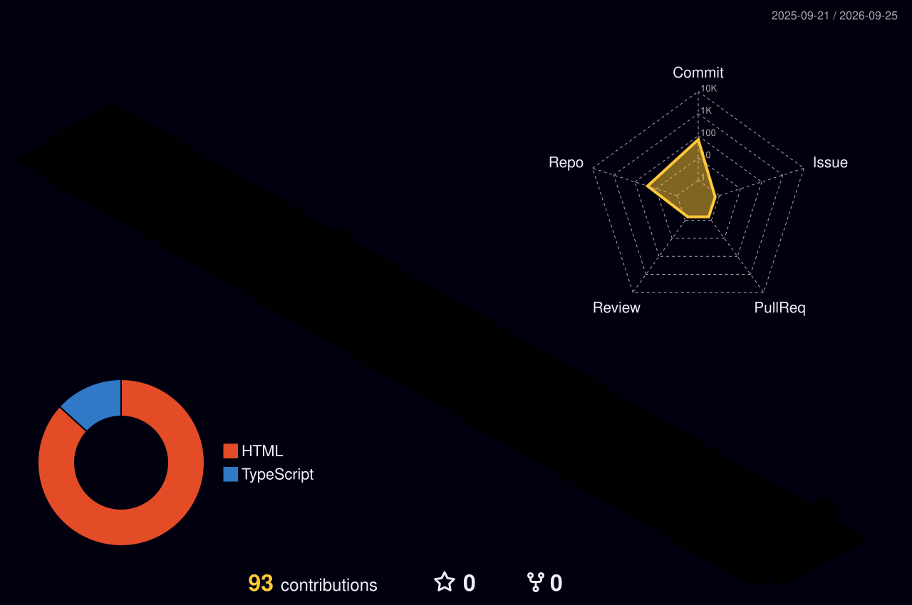

<div align="center">


<a href="https://github.com/DenverCoder1/readme-typing-svg">
  
</a>

<br/>

<a href="https://linkedin.com/in/alexandrevrocha"></a>
<a href="mailto:alexandrev.rocha@hotmail.com"></a>


<sub>
<a href="#-about">About</a> •
<a href="#-what-i-do">What I do</a> •
<a href="#-products--platforms">Products</a> •
<a href="#-projects">Projects</a> •
<a href="#-experience">Experience</a> •
<a href="#-certifications--education">Certifications</a> •
<a href="#-live-stats">Live stats</a>
</sub>

</div>

---

## 👋 About

Lead Cybersecurity Engineer with **14+ years in IT** and **7+ years focused on offensive security, vulnerability management and SOC operations**. I help organisations find and fix weaknesses before attackers do — from web application pentests to enterprise-scale EDR/XDR detection engineering.

```yaml
role:        Lead Cybersecurity Engineer
focus:       [Pentesting, Vulnerability Management, Threat Hunting, EDR/XDR]
frameworks:  [MITRE ATT&CK, OWASP Top 10, NIST CSF, ISO 27001]
currently:   Exploring LLM application security & offensive AI testing
open_to:     Security collaboration, research and knowledge sharing
```

---

## 🎯 What I Do

| Area | In practice |
| :--- | :--- |
| **Offensive Security** | Web app (OWASP), network and infrastructure pentests; enumeration, manual exploitation and threat simulation |
| **Vulnerability Management** | Asset discovery, Qualys VMDR/WAS scanning workflows, custom QQL and risk-based remediation plans |
| **Detection & Response** | L3 incident escalation, threat hunting, endpoint isolation and forensic triage with CrowdStrike Falcon RTR |
| **Reporting & Governance** | Technical pentest reports and executive summaries that translate risk into business decisions |

---

## 🧰 Products & Platforms

Platforms I deploy, operate or assess in production environments.

| Category | Products | How I use them |
| :--- | :--- | :--- |
| **EDR / XDR** | CrowdStrike Falcon | Policy tuning, RTR triage, host isolation, threat hunting |
| **Vulnerability Management** | Qualys VMDR, Qualys WAS | Asset discovery, scan orchestration, QQL dashboards, remediation tracking |
| **SIEM / SOC** | FortiSIEM | Correlation rules, use-case engineering, alert triage |
| **Network Security** | Fortinet FortiGate | Firewall policies, VPN tunnels, segmentation |
| **Edge / WAF** | Cloudflare | WAF rules, DDoS protection, access policies |
| **Identity** | Keycloak | SSO / OIDC configuration and hardening |
| **Offensive Tooling** | Burp Suite, Metasploit, Nmap, Kali Linux | Web and network assessments, exploitation |
| **Reporting** | SysReptor | Pentest findings management and report generation |
| **Cloud & Automation** | AWS, Docker, Python, PowerShell, Bash | Tooling, automation and lab environments |
<!-- ADD: other products from LinkedIn (e.g. other EDRs, SIEMs, scanners, cloud platforms) -->

<details>
<summary><b>Tech stack badges</b></summary>
<br/>


</details>

---

## 🏗️ Projects

<!--
ADD only real projects. Template (one block per project):

<details>
<summary><b>Project name</b> · Year · <code>Tag</code> <code>Tag</code></summary>
<br/>

- **Context:** what was needed
- **What I did:** your role and actions
- **Result:** measurable outcome

</details>
-->

---

## 💼 Experience

**Lead Cybersecurity Engineer** · Claranet
<br/><sub>Jun 2020 – Present · Dublin, Ireland (remote) & São Paulo, Brazil</sub>
- Lead web application, network and infrastructure pentests for managed enterprise clients
- Run continuous vulnerability management programmes with Qualys VMDR and custom QQL
- Act as L3 escalation point for complex incidents, threat hunting and containment
- Manage CrowdStrike Falcon EDR/XDR and engineer SOC correlation rules in FortiSIEM
<!-- If LinkedIn lists separate positions inside Claranet (e.g. Analyst → Senior → Lead), list each with its dates -->

**Network & Telecommunications Engineer** · Amistad Networks
<br/><sub>Jul 2015 – Mar 2019 · Brazil</sub>
- Deployed and secured core networks, firewalls, routing and encrypted VPN tunnels

<details>
<summary><b>Earlier experience</b></summary>
<br/>

<!-- ADD earlier roles from LinkedIn (supports the "14+ years in IT" claim) -->

</details>

---

## 🎓 Certifications & Education

| Certifications | Education |
| :--- | :--- |
| **CEH** — Certified Ethical Hacker (EC-Council) | **Postgraduate, Cybersecurity** — Instituto Daryus (2023–2024) |
| **CCFA** — CrowdStrike Certified Falcon Administrator | **BSc, Information Security Management** — UNINOVE (2018–2021) |
| **CLLMSP** — Certified LLM Security Professional | |
| **Fortinet Certified Associate** in Cybersecurity | |
| **EC-Council EHE & NDE** · **AWS** Architecting on AWS (training) | |

---

## 📊 Live Stats

<div align="center">


<br/><br/>



<br/>

<picture>
  <source media="(prefers-color-scheme: dark)" srcset="https://raw.githubusercontent.com/RochaCrypt/RochaCrypt/output/snake-dark.svg"/>
  
</picture>

<!-- Offensive-security platforms: uncomment and replace YOUR_USER / YOUR_ID -->
<!--  -->
<!--  -->

</div>

---

<div align="center">
<sub>🔐 Security is a process, not a product. · Always hack ethically and with authorisation.</sub>
<br/><br/>

</div>
