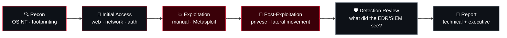

<div align="center">


<a href="https://github.com/DenverCoder1/readme-typing-svg">
  
</a>

<br/>

<a href="https://linkedin.com/in/alexandrevrocha"></a>
<a href="mailto:alexandrev.rocha@hotmail.com"></a>


<sub>
<a href="#-whoami">whoami</a> ·
<a href="#-kill-chain">kill chain</a> ·
<a href="#-arsenal">arsenal</a> ·
<a href="#-operations">operations</a> ·
<a href="#-career-log">career</a> ·
<a href="#-certs">certs</a> ·
<a href="#-activity">activity</a>
</sub>

</div>

---

## 💀 whoami

```console
root@rochacrypt:~# cat profile.txt
name       : Alexandre Rocha
role       : Lead Cybersecurity Engineer — Offensive Security
experience : 14+ yrs IT · 7+ yrs offensive security, vuln management & SOC
base       : Dublin, Ireland  [EN | PT-BR]
mindset    : think like an attacker, report like a consultant
frameworks : MITRE ATT&CK · OWASP Top 10 · NIST CSF · ISO 27001
researching: LLM application security & offensive AI testing
rules      : authorised targets only. always.
```

---

## 🎯 Kill Chain

How I work an engagement — from first packet to executive report.



| Phase | MITRE ATT&CK | What I do |
| :--- | :--- | :--- |
| **Recon** | TA0043 | Network footprinting, service enumeration, attack-surface mapping |
| **Initial Access** | TA0001 | Web application testing against OWASP Top 10, exposed services, weak auth |
| **Exploitation** | TA0002 | Manual exploitation and controlled threat simulation |
| **Post-Exploitation** | TA0004 · TA0008 | Privilege escalation and lateral movement paths |
| **Detection Review** | — | Purple-team view: validating what CrowdStrike Falcon and FortiSIEM actually caught |
| **Report** | — | Evidence-driven findings, risk ratings and remediation for tech and exec audiences |

---

## ⚔️ Arsenal

<table>
<tr>
<td valign="top" width="50%">

**🔴 Offensive**

| Use | Tools |
| :--- | :--- |
| Recon & enumeration | Nmap, Kali Linux |
| Web app testing | Burp Suite, OWASP methodology |
| Exploitation | Metasploit |
| Vuln discovery | Qualys VMDR / WAS, custom QQL |
| Reporting | SysReptor |
<!-- ADD more offensive tools -->

</td>
<td valign="top" width="50%">

**🔵 Defenses I operate & test against**

| Use | Platforms |
| :--- | :--- |
| EDR / XDR | CrowdStrike Falcon (RTR) |
| SIEM | FortiSIEM |
| Firewall / VPN | Fortinet FortiGate |
| Edge / WAF | Cloudflare |
| Identity / SSO | Keycloak |
<!-- ADD more platforms -->

</td>
</tr>
</table>

<div align="center">


</div>

---

## 🗂️ Operations

<!--
ADD only real engagements/projects. Client names omitted for confidentiality.

<details>
<summary><b>[OP-01] Engagement name</b> · Year · <code>Web</code> <code>Internal</code></summary>
<br/>

- **Scope:** what was tested
- **Approach:** techniques / ATT&CK tactics used
- **Impact:** key finding type and business risk (no sensitive details)
- **Outcome:** what got fixed / measurable result

</details>
-->

> 🔒 Engagement details are confidential. Sanitised write-ups coming soon.

---

## 📜 Career Log

```console
root@rochacrypt:~# cat /var/log/career.log
```

**Lead Cybersecurity Engineer** · Claranet
<br/><sub>Jun 2020 – Present · Dublin, Ireland (remote) & São Paulo, Brazil</sub>
- Lead web application, network and infrastructure penetration tests for managed enterprise clients
- Run continuous vulnerability management with Qualys VMDR and custom QQL
- L3 escalation for complex incidents, threat hunting and containment
- Operate CrowdStrike Falcon EDR/XDR and engineer FortiSIEM correlation rules
<!-- If you held several positions at Claranet, list each with its dates -->

**Network & Telecommunications Engineer** · Amistad Networks
<br/><sub>Jul 2015 – Mar 2019 · Brazil</sub>
- Deployed and hardened core networks, firewalls, routing and encrypted VPN tunnels

<details>
<summary><b>Earlier experience</b></summary>
<br/>

<!-- ADD earlier roles -->

</details>

---

## 🏴 Certs

```console
root@rochacrypt:~# ls ~/certs
```

| Certification | Issuer |
| :--- | :--- |
| **CEH** — Certified Ethical Hacker | EC-Council |
| **CCFA** — CrowdStrike Certified Falcon Administrator | CrowdStrike |
| **CLLMSP** — Certified LLM Security Professional | — |
| **Certified Associate in Cybersecurity** | Fortinet |
| **Ethical Hacking Essentials** · **Network Defense Essentials** | EC-Council |
| **Architecting on AWS** (training) | AWS |

🎓 **Postgraduate, Cybersecurity** — Instituto Daryus (2023–2024) · **BSc, Information Security Management** — UNINOVE (2018–2021)

---

## 📡 Activity

```console
root@rochacrypt:~# tail -f activity.log
```

<div align="center">


<br/><br/>


<picture>
  <source media="(prefers-color-scheme: dark)" srcset="https://raw.githubusercontent.com/RochaCrypt/RochaCrypt/output/snake-dark.svg"/>
  
</picture>

<!-- Uncomment and replace YOUR_USER / YOUR_ID -->
<!--  -->
<!--  -->

</div>

---

<div align="center">

```console
[!] All techniques and tooling are used exclusively in authorised engagements.
```

<sub>🔐 Security is a process, not a product.</sub>


</div>
