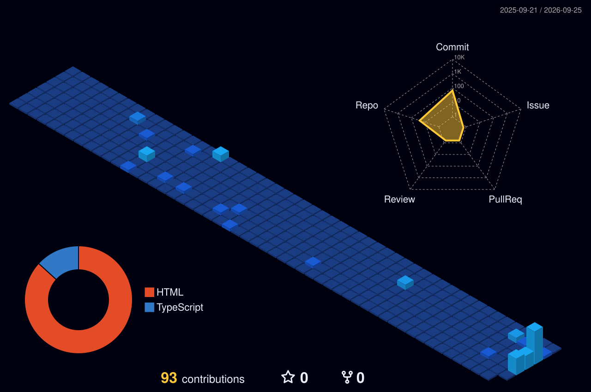

<div align="center">


<a href="https://github.com/DenverCoder1/readme-typing-svg">
  
</a>

<br/><br/>

<a href="https://linkedin.com/in/alexandrevrocha"></a>
<a href="mailto:alexandrev.rocha@hotmail.com"></a>


<br/><br/>

[](#summary)
[](#latest-in-cybersecurity)
[](#core-expertise)
[](#experience)
[](#technologies)
[](#projects-and-knowledge-base)
[](#certifications-and-education)
[](#activity)

</div>

---

## Summary

```text
                          alexandre@rochacrypt
        .:~!!!!!~:.       ------------------------------------------------
      :!!!!!!!!!!!!!:     Role........  Lead Cybersecurity Engineer
     !!!!!!!!!!!!!!!!!    Discipline..  Offensive Security · Detection · Response
    !!!!!:     :!!!!!!    Experience..  14+ years in IT · 7+ years in security
    !!!!.        .::::    Location....  Dublin, Ireland
    !!!!!:     :!!!!!!    Languages...  PT-BR (native) · EN (professional) · ES (basic)
     !!!!!!!!!!!!!!!!!    Frameworks..  MITRE ATT&CK · OWASP · NIST CSF · ISO 27001
      :!!!!!!!!!!!!!:     Researching.  LLM application security · offensive AI
        .:~!!!!!~:.       Credentials.  CEH · CCFA · CLLMSP
                          Principle...  Think like an attacker, report like a consultant
```

Cybersecurity professional with over 14 years in IT and 7+ years specialising in
information security, security operations and cybersecurity consulting. I lead
security initiatives across enterprise and multi-tenant environments, combining
technical depth in penetration testing, vulnerability management, incident response
and EDR/XDR with a consultative, business-focused approach. I align delivery with
recognised frameworks and translate technical risk into clear reporting for both
engineering and executive audiences.

---

## Latest in Cybersecurity

<!-- CYBER-NEWS:START -->

**[Chinese hackers exploit multiple technologies to steal govt data](https://www.bleepingcomputer.com/news/security/chinese-hackers-exploit-multiple-technologies-to-steal-govt-data/)**  
A Chinese-speaking threat actor has been exploiting vulnerabilities in ZyXEL GS1900 Smart Managed Switches and WordPress to steal sensitive data from…  
<sub>`BleepingComputer`</sub>

**[Microsoft Disrupts EvilTokens Device Code Phishing Service](https://www.darkreading.com/identity-access-management-security/microsoft-disrupts-eviltokens-device-code-phishing-service)**  
Microsoft seized 50 websites and disabled more than 150 domains as part of a coordinated disruption effort against a phishing-as-a-service platform…  
<sub>`Dark Reading`</sub>

**[ShinyHunters claims FBI hack, data theft in PeopleSoft zero-day breach](https://www.bleepingcomputer.com/news/security/shinyhunters-claims-fbi-hack-data-theft-in-peoplesoft-zero-day-breach/)**  
The ShinyHunters extortion gang claims it breached FBI systems using a new Oracle PeopleSoft zero-day vulnerability, gaining access to internal…  
<sub>`BleepingComputer`</sub>

**[Check Point Warns of Management Server Zero-Day Exploited in Targeted Attacks](https://thehackernews.com/2026/09/check-point-warns-of-management-server.html)**  
Attackers exploited a previously unknown flaw in Check Point's Security Management Server in a handful of targeted attacks on July 23, the company…  
<sub>`The Hacker News`</sub>

**[New ClosedQuorum Windows malware uses AI for attack decisions](https://www.bleepingcomputer.com/news/security/new-closedquorum-windows-malware-uses-ai-for-attack-decisions/)**  
A new Windows malware named ClosedQuorum uses Google Gemini, DeepSeek, Qwen, and Mistral AI models to autonomously determine the actions to take…  
<sub>`BleepingComputer`</sub>

**[WordPress Issues Patch for Critical Flaw That Can Enable Code Execution on Some Servers](https://thehackernews.com/2026/09/wordpress-issues-patch-for-critical.html)**  
WordPress has fixed a critical flaw in its core software that lets an attacker with no account make a site load a PHP file from outside its theme…  
<sub>`The Hacker News`</sub>

**[Malicious npm Package Poses as Twilio Bug-Bounty Probe, Can Exfiltrate Credentials](https://thehackernews.com/2026/09/malicious-npm-package-poses-as-twilio.html)**  
Cybersecurity researchers have disclosed details of a malicious npm package named "tw-pkgprobe-7731" that masquerades as a security tool targeting…  
<sub>`The Hacker News`</sub>

**[BigCommerce Data Stolen via Ribon Apps Hack](https://www.securityweek.com/bigcommerce-data-stolen-via-ribon-apps-hack/)**  
The attackers used a compromised BigCommerce application key held by Ribon to access customer data. The post BigCommerce Data Stolen via Ribon Apps…  
<sub>`SecurityWeek`</sub>

<!-- CYBER-NEWS:END -->

<sub>Auto-updated every 6 hours from The Hacker News, BleepingComputer, Krebs on Security, Dark Reading, SecurityWeek, The Record and CISA advisories. Headlines link to the original source.</sub>

---

## Core Expertise

| Area | Focus |
| :--- | :--- |
| **Offensive Security** | Web application, network and infrastructure penetration testing; manual exploitation; controlled threat simulation |
| **Vulnerability Management** | Enterprise asset discovery, Qualys VMDR/WAS, custom QQL, risk-based remediation planning |
| **Detection & Response** | EDR/XDR operations (CrowdStrike Falcon), threat hunting, forensic triage, Level 3 incident response |
| **Security Operations** | SIEM engineering (FortiSIEM), correlation rules, monitoring use cases, SOC capability development |
| **Cloud & Architecture** | Private, Public and Hybrid cloud security; security architecture design and review |
| **Governance & Reporting** | NIST CSF, ISO 27001, MITRE ATT&CK and OWASP alignment; technical and executive reporting |

**Engagement approach**  
`Reconnaissance` → `Assessment` → `Exploitation` → `Post-exploitation` → `Detection review (purple-team)` → `Technical & executive reporting`

---

## Experience

### Claranet
<sub>March 2019 – Present · 7+ years · Managed security and cloud services provider</sub>

**Lead Cybersecurity Engineer** — *March 2026 – Present · Dublin, Ireland (Remote)*
- Lead technical cybersecurity initiatives across managed security and cloud environments, supporting Private, Public and Hybrid Cloud customers
- Lead penetration testing engagements across infrastructure, network and web application environments
- Design, implement and manage EDR/XDR solutions, including CrowdStrike Falcon
- Provide Level 3 technical support and escalation for security incidents and complex projects
- Lead incident response investigations and threat analysis activities
- Perform vulnerability assessments, risk analysis and remediation planning; support the design of SOC capabilities
- Review and approve security architectures for customer projects
- Deliver executive and technical security reports and provide technical mentoring to security teams
- Ensure alignment with NIST CSF, MITRE ATT&CK, OWASP and ISO 27001

**Senior Cybersecurity Analyst** — *September 2024 – March 2026 · São Paulo, Brazil (Hybrid)*
- Led security operations, threat detection and vulnerability management across managed customer environments
- Conducted Proof of Concepts and technical evaluations of cybersecurity solutions; managed EDR, MDR and XDR platforms
- Designed and deployed firewalls, IDS/IPS, WAF and DDoS protection solutions
- Built SIEM use cases, correlation rules and monitoring dashboards
- Investigated security incidents, coordinated response actions and supported ISO 27001 governance initiatives

**Cybersecurity Engineer** — *June 2021 – September 2024 · Brazil (Hybrid)*
- Designed and implemented secure network and cybersecurity architectures, from project initiation through production deployment
- Deployed and managed firewalls, IDS/IPS, WAF, Web Filtering and Application Control solutions
- Implemented centralised log management and SIEM integrations
- Developed and enforced security policies using FortiManager
- Supported pre-sales teams in customer workshops and technical demonstrations

<details>
<summary><b>Earlier roles at Claranet</b></summary>
<br/>

**Information Security Analyst** — *June 2020 – July 2021 · Brazil (On-site)*
- Supported cybersecurity operations, vulnerability management and customer security projects within managed service environments
- Monitored and investigated security alerts; assisted with vulnerability assessments and remediation activities

**Junior Information Security Analyst** — *March 2019 – June 2020 · Barueri, Brazil (On-site)*
- Monitored security events and alerts, supported vulnerability scanning and participated in incident response processes

</details>

### Amistad Networks
<sub>July 2015 – March 2019 · 3 years 9 months</sub>

<details>
<summary><b>Network &amp; Telecommunications Engineer · Technical Support Specialist</b></summary>
<br/>

**Network & Telecommunications Engineer** — *April 2017 – March 2019 · Brazil*
- Designed, deployed and supported telecommunications, networking and infrastructure solutions for enterprise customers
- Installed, configured and managed enterprise network infrastructure including routers, switches and firewalls; supported VPN, VLAN, NAT and routing services
- Supported the implementation of information security controls and secure network architectures; participated in network incident investigation and service restoration

**Technical Support Specialist** — *July 2015 – April 2017 · Brazil*
- Provided first-line technical support for telecommunications and network services
- Supported VoIP deployments and infrastructure troubleshooting

</details>

---

## Technologies

Platforms and tools I operate in production and assessment environments.

| Domain | Technologies |
| :--- | :--- |
| **Offensive & Assessment** | Nmap, Burp Suite, Metasploit, Kali Linux, Qualys VMDR, Qualys WAS, OWASP methodology |
| **Detection & Response** | CrowdStrike Falcon (RTR), FortiEDR, FortiSIEM |
| **Network & Perimeter** | FortiGate, FortiManager, IDS/IPS, Web Filtering, Application Control, Cloudflare (WAF/DDoS) |
| **Identity & Cloud** | Keycloak, AWS, Private / Public / Hybrid Cloud |
| **Automation & Scripting** | Python, PowerShell, Bash, Docker |

<div align="center">


</div>

---

## Projects and Knowledge Base

Open resources I build and maintain for the community.

| Repository | Description | Stack |
| :--- | :--- | :--- |
| **[Arsenal](https://github.com/RochaCrypt/arsenal)** | Interactive catalog of 112 security tools, segmented by function, plus my own operational scripts. [Live catalog](https://rochacrypt.github.io/arsenal/). | `Bash` · `Python` · `PowerShell` · `HTML` |
| **[Security Knowledge Base](https://github.com/RochaCrypt/security-knowledge-base)** | 50 certification and framework references — what each is, what it validates, key concepts and a mind map. | `Docs` · `Mermaid` |

<div align="center">

<a href="https://rochacrypt.github.io/arsenal/"></a>
<a href="https://github.com/RochaCrypt/security-knowledge-base"></a>

</div>

---

## Certifications and Education

**Certifications**

| Credential | Issuer |
| :--- | :--- |
| Certified Ethical Hacker (CEH) | EC-Council |
| CrowdStrike Certified Falcon Administrator (CCFA) | CrowdStrike |
| Certified LLM Security Professional (CLLMSP) | — |
| Certified Associate in Cybersecurity | Fortinet |
| Ethical Hacking Essentials (EHE) · Network Defense Essentials (NDE) | EC-Council |
| Architecting on AWS (training) | AWS |

**Education**

- **Postgraduate Degree, Cybersecurity** — Instituto Daryus (2023 – 2024)
- **Bachelor's Degree, Information Security Management** — UNINOVE (2018 – 2021)

---

## Activity

<div align="center">


<br/><br/>



<picture>
  <source media="(prefers-color-scheme: dark)" srcset="https://raw.githubusercontent.com/RochaCrypt/RochaCrypt/output/snake-dark.svg"/>
  
</picture>

</div>

<!-- Add offensive-platform badges when available:


-->

---

<div align="center">

<sub>All techniques and tooling are used exclusively in authorised engagements. · Security is a process, not a product.</sub>


</div>
